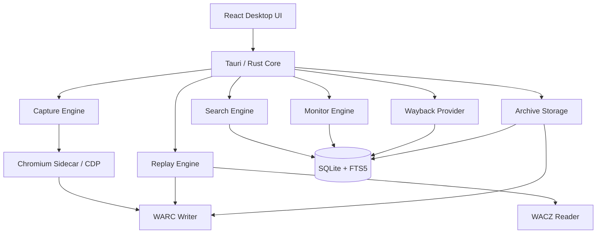

# 本地网页时光机（Local Web Time Machine）开发设计文档

> 文档类型：产品需求 + 技术架构 + 开发实施规范  
> 推荐技术栈：Tauri v2 + Rust + React 18 + TypeScript + Chromium/CDP + SQLite  
> 核心归档格式：WARC 1.1 / WACZ  
> 文档版本：v1.0  
> 日期：2026-09-17

---

# 1. 项目概述

## 1.1 项目定位

本项目是一款运行在本地桌面的“网页时光机”，用于对指定网页、站点或站点目录进行长期抓取、归档、搜索、比较与离线回放。

产品目标不是简单地“下载网页 HTML”，而是尽可能保存一次真实浏览器访问网页时产生的完整网络会话，包括：

- HTML
- CSS
- JavaScript
- 图片
- 字体
- JSON / XHR / Fetch
- iframe
- 音频
- 视频
- HLS / DASH 清单及媒体分片
- Web Manifest
- 页面截图
- 页面正文
- 页面元数据
- 页面之间的链接关系
- 页面版本变化

软件应允许用户：

1. 添加网站或具体页面。
2. 手动抓取或定时监控。
3. 自动发现站内子页面。
4. 控制抓取深度、范围、频率和容量。
5. 浏览某个网页过去某个时间点的版本。
6. 对比不同时间版本之间的差异。
7. 全文搜索所有历史网页。
8. 从 Internet Archive / Wayback Machine 获取历史版本。
9. 将 Wayback 历史导入本地。
10. 离线浏览已归档网页。
11. 导入、导出 WARC / WACZ。
12. 对广告、弹窗、媒体、iframe、脚本等进行策略化处理。

最终产品形态：

> 本地 Wayback Machine + 网页监控工具 + 历史搜索引擎 + 网页归档浏览器。

---

# 2. 核心设计原则

## 2.1 不以“保存 HTML 文件”为核心

禁止将核心实现设计成：

```text
site/
├── index.html
├── css/
├── js/
└── images/
```

这种方式只能覆盖传统静态网站。

现代网站大量依赖：

- React / Vue / Angular
- SPA
- 动态 import
- XHR
- GraphQL
- Fetch
- Service Worker
- Canvas
- WebGL
- 懒加载
- 无限滚动
- iframe
- HLS / DASH
- API 数据驱动
- JavaScript 运行后生成的 DOM

因此抓取核心必须采用：

```text
真实 Chromium
    ↓
监听浏览器网络流量
    ↓
保存 Request / Response
    ↓
写入 WARC
```

而不是：

```text
HTTP GET
    ↓
HTML
```

---

# 3. 总体架构



核心模块建议拆分为：

```text
1. Capture Engine
2. Crawl Frontier
3. Archive Storage
4. Replay Engine
5. Search Engine
6. Diff Engine
7. Monitor Engine
8. Wayback Provider
9. Chromium Controller
10. Desktop UI
11. Import / Export
12. Task Scheduler
```

---

# 4. 技术栈

## 4.1 桌面应用

推荐：

```text
Tauri v2
Rust
React 18
TypeScript
Vite
```

优势：

- 安装包小。
- Rust 适合本地数据库、文件和网络处理。
- React 负责复杂 UI。
- Chromium 抓取可以独立为 Sidecar。
- 主程序与浏览器抓取进程隔离。

---

## 4.2 抓取浏览器

推荐：

```text
Chromium / Chrome for Testing
+
Chrome DevTools Protocol
```

不建议完全依赖 Tauri WebView 抓取。

Capture Engine 应能够控制：

```text
Browser
BrowserContext
Page
Target
Frame
Network
Runtime
DOM
Page
Fetch
Storage
```

核心功能包括：

- 创建浏览器。
- 创建独立 Context。
- 设置 User-Agent。
- 设置 Cookie。
- 设置语言。
- 设置屏幕尺寸。
- 页面加载。
- 网络监听。
- 请求拦截。
- 页面滚动。
- JS 执行。
- 截图。
- 弹窗监听。
- iframe 监听。
- 下载监听。

---

# 5. 数据存储架构

推荐分层存储：

```text
SQLite
+
WARC
+
WACZ
+
Screenshot
+
Thumbnail
+
Diff Cache
```

---

# 6. 本地目录结构

建议：

```text
AppData/
└── LocalWebTimeMachine/
    ├── app.db
    ├── config/
    │   ├── app.json
    │   ├── filters.json
    │   └── profiles/
    ├── archives/
    │   ├── site-001/
    │   │   ├── 2026/
    │   │   │   ├── 09/
    │   │   │   │   ├── capture-001.warc.gz
    │   │   │   │   └── capture-002.warc.gz
    │   │   └── index/
    ├── screenshots/
    ├── thumbnails/
    ├── exports/
    ├── temp/
    ├── logs/
    └── chromium/
```

---

# 7. WARC / WACZ 设计

## 7.1 WARC

WARC 用于保存浏览器真实产生的网络请求和响应。

保存对象：

```text
request
response
resource
metadata
revisit
```

每一次 HTTP 请求至少记录：

```text
URL
Method
Request Headers
Request Body
Timestamp
Response Status
Response Headers
Response Body
MIME
Content-Length
Digest
```

---

## 7.2 WARC 分卷

避免单文件无限增大。

建议配置：

```text
默认最大 WARC：
2 GB

可选：
512 MB
1 GB
2 GB
4 GB
```

达到阈值自动轮转。

---

## 7.3 WACZ

WACZ 用于：

- 单站点导出。
- 快照分享。
- 备份。
- 跨设备导入。
- ReplayWeb.page 兼容。

支持：

```text
导入 .wacz
导出 .wacz
```

---

# 8. SQLite 数据模型

建议至少包含以下表。

---

## 8.1 sites

```sql
CREATE TABLE sites (
    id TEXT PRIMARY KEY,
    name TEXT,
    root_url TEXT NOT NULL,
    normalized_host TEXT,
    created_at INTEGER NOT NULL,
    updated_at INTEGER NOT NULL,
    enabled INTEGER DEFAULT 1
);
```

---

## 8.2 crawl_profiles

```text
id
site_id
scope_type
include_rules
exclude_rules
max_depth
max_pages
max_size
max_duration
concurrency
wait_strategy
media_policy
ad_policy
popup_policy
iframe_policy
created_at
updated_at
```

---

## 8.3 crawl_jobs

```text
id
site_id
profile_id
status
started_at
finished_at
pages_discovered
pages_captured
resources_captured
bytes_written
error_count
trigger_type
```

status：

```text
queued
running
paused
completed
cancelled
failed
```

---

## 8.4 crawl_queue

```text
id
job_id
url
normalized_url
parent_url
depth
priority
status
retry_count
discovered_at
started_at
finished_at
```

---

## 8.5 pages

```text
id
site_id
url
normalized_url
title
first_seen
last_seen
capture_count
```

---

## 8.6 captures

```text
id
page_id
job_id
captured_at
status_code
mime_type
warc_file
warc_offset
warc_length
screenshot_path
text_hash
dom_hash
visual_hash
resource_count
missing_resource_count
capture_score
```

---

## 8.7 resources

```text
id
capture_id
url
normalized_url
mime_type
status_code
size
sha256
warc_file
warc_offset
resource_type
```

resource_type：

```text
document
stylesheet
script
image
font
xhr
fetch
media
manifest
websocket
other
```

---

## 8.8 links

用于页面拓扑关系。

```text
source_page_id
target_url
relation
discovered_at
```

relation：

```text
anchor
iframe
redirect
popup
resource
```

---

## 8.9 monitor_rules

```text
id
site_id
url
schedule
strategy
selector
keyword
enabled
last_checked
next_check
```

---

## 8.10 change_events

```text
id
page_id
old_capture_id
new_capture_id
text_changed
dom_changed
visual_changed
resource_changed
change_score
created_at
```

---

## 8.11 wayback_captures

```text
id
url
timestamp
status_code
mime_type
digest
length
source
imported
```

---

# 9. Crawl Frontier

Frontier 是整个爬虫系统最核心的组件之一。

职责：

```text
发现 URL
↓
标准化
↓
去重
↓
Scope 判断
↓
优先级计算
↓
加入 Queue
↓
调度 Chromium
```

---

# 10. URL 标准化

必须实现 URL Normalizer。

例如：

```text
https://example.com/page#section1
https://example.com/page#section2
```

默认视为同一个页面。

应默认清理：

```text
utm_source
utm_medium
utm_campaign
utm_term
utm_content
fbclid
gclid
yclid
spm
```

用户应可以配置：

```text
忽略参数
保留参数
参数白名单
参数黑名单
```

---

# 11. URL 去重

建议：

```text
normalized_url
+
scope
```

唯一约束。

可增加 Bloom Filter 用于超大抓取任务。

MVP 阶段 SQLite UNIQUE INDEX 足够。

---

# 12. 抓取范围 Scope

支持：

## 12.1 Current Page

只抓当前 URL。

---

## 12.2 Prefix

例如：

```text
https://example.com/blog/*
```

---

## 12.3 Host

```text
www.example.com/*
```

---

## 12.4 Domain

```text
*.example.com/*
```

---

## 12.5 Sitemap

解析：

```text
/sitemap.xml
/sitemap_index.xml
```

---

## 12.6 Custom

支持：

```text
Include Regex
Exclude Regex
```

示例：

```text
include:
/article/.+

exclude:
/login
/search
/calendar
```

---

# 13. Crawl Trap 防护

必须防止：

```text
/calendar?day=1
/calendar?day=2
/calendar?day=3
...
```

以及：

```text
/search?q=a
/search?q=aa
```

默认检测：

- URL 深度异常。
- Query 参数数量异常。
- 相同路径参数组合爆炸。
- 连续数字分页爆炸。
- 日历模式。
- Session ID。
- 无限滚动。
- 无限 API 翻页。

应提供：

```text
每路径最大 URL 数
每参数最大不同值数量
最大 Query 参数数量
最大 URL 长度
```

---

# 14. 抓取流程

单页面标准抓取流程：

```text
创建 BrowserContext
↓
打开 URL
↓
监听 Network
↓
等待 DOMContentLoaded
↓
等待网络稳定
↓
执行 Autoscroll
↓
触发 Lazy Load
↓
执行 Autofetch
↓
可选 Autoplay
↓
可选 Autoclick
↓
再次等待网络稳定
↓
提取 DOM
↓
提取正文
↓
提取链接
↓
Full Page Screenshot
↓
计算 Hash
↓
写 WARC
↓
写 SQLite
↓
关闭页面
```

---

# 15. 页面等待策略

支持：

```text
DOMContentLoaded
load
networkidle
固定等待
自定义 selector
自定义 JavaScript condition
```

默认：

```text
DOMContentLoaded
+
networkidle
+
2 秒稳定窗口
```

但必须设置最大超时。

例如：

```text
页面最大加载时间：
45 秒
```

---

# 16. SPA 支持

SPA 场景必须使用真实浏览器。

需要处理：

```text
history.pushState
history.replaceState
hash route
React Router
Vue Router
XHR
fetch
GraphQL
dynamic import
```

可以通过 CDP 监听：

```text
Page.frameNavigated
Page.navigatedWithinDocument
Network.requestWillBeSent
```

---

# 17. Autoscroll

用于触发：

- 懒加载图片。
- 无限列表。
- 延迟组件。
- 视频封面。
- 评论区。

推荐算法：

```text
step = viewport_height * 0.8

每次滚动
↓
等待 300~800ms
↓
检查页面高度变化
```

结束条件：

```text
连续 N 次高度不增长
或
达到 max_scrolls
或
达到 max_page_height
```

---

# 18. Infinite Scroll

无限滚动不能无限抓。

默认：

```text
最大滚动次数：20
最大新增 DOM：5000
最大页面高度：200000 px
```

允许站点级覆盖。

---

# 19. Autofetch

用于补抓：

```text
img[data-src]
img[data-original]
srcset
picture
background-image
lazy CSS assets
preload
prefetch
```

需要避免主动抓：

```text
未知超大视频
下载文件
跨域无限资源
```

---

# 20. JavaScript

默认保存全部加载到的 JS。

同时保存：

```text
URL
MIME
SHA256
Size
```

可以提供：

```text
脚本变化检测
```

例如：

```text
app.a312.js
→
app.f719.js
```

---

# 21. 图片资源

支持：

```text
jpg
jpeg
png
webp
avif
gif
svg
ico
bmp
```

建议记录：

```text
width
height
size
sha256
mime
```

后期可生成图片资源库。

---

# 22. 字体

支持：

```text
woff
woff2
ttf
otf
eot
```

字体必须归档，否则离线回放可能严重变形。

---

# 23. 音频

支持：

```text
mp3
aac
ogg
wav
flac
m4a
```

策略：

```text
off
metadata_only
limited
full
```

limited：

```text
单文件最大 50 MB
```

---

# 24. 视频

支持：

```text
mp4
webm
mov
```

以及流媒体：

```text
HLS
m3u8
ts

DASH
mpd
m4s
```

必须允许限制：

```text
单视频最大大小
站点媒体总大小
最大保存时长
是否保存分片
```

默认建议：

```text
普通视频：
200 MB

单次抓取媒体总量：
1 GB

HLS/DASH：
默认只保存 manifest
```

完整媒体归档由用户主动开启。

---

# 25. 背景音乐

对：

```html
<audio autoplay>
```

或 JS 创建的 Audio：

```javascript
new Audio(...)
```

通过网络流量捕获。

必要时执行：

```text
Autoplay Behavior
```

触发加载。

---

# 26. CSS 动画

CSS 动画本身不需要录像。

只要保存：

```text
HTML
CSS
字体
图片
```

回放时即可重新运行。

---

# 27. JS 动画

普通 JS 动画通过归档 JS 可以恢复。

但以下内容不能保证：

```text
Canvas
WebGL
WebGPU
实时服务器数据
在线游戏
DRM
随机内容
实时 WebSocket
```

所以每个 Capture 必须额外保存：

```text
Full-page screenshot
```

作为视觉兜底。

未来可增加：

```text
页面录屏
```

---

# 28. iframe

策略：

```text
same_origin
all
none
custom
```

推荐默认：

```text
同域 iframe：
完整保存

跨域 iframe：
保存其实际加载资源
但不自动扩大 Crawl Scope
```

---

# 29. Popup

监听：

```text
window.open
target=_blank
CDP TargetCreated
```

策略：

```text
block
record
crawl_if_in_scope
crawl_all
```

推荐：

```text
默认 crawl_if_in_scope
```

---

# 30. 原生浏览器弹窗

自动处理：

```text
alert
confirm
prompt
permission
notification
download
beforeunload
```

默认：

```text
alert → dismiss
confirm → cancel
prompt → cancel
notification → deny
camera → deny
microphone → deny
location → deny
```

---

# 31. 广告处理

必须区分：

## 原始归档模式

保存：

```text
广告
Analytics
Tracking
Cookie Banner
Popup
```

优点：

历史真实性最高。

---

## 净化归档模式

抓取阶段阻止：

```text
ad
tracking
analytics
popup
cookie consent
```

---

## 推荐实现

默认：

```text
保存原始网络归档
+
回放阶段支持净化
```

UI：

```text
[原始模式] [净化模式]
```

净化可以使用：

```text
URL Filter
CSS Rule
DOM Hide Rule
```

这样不会破坏原始历史。

---

# 32. Cookie Banner

提供：

```text
保留
自动接受
自动拒绝
隐藏
```

未来可引入规则库。

---

# 33. 登录页面

MVP 不自动破解登录。

支持：

```text
用户手工登录
↓
保存 Browser Profile / Cookies
↓
后续定时抓取使用该 Profile
```

Cookie、Token 等敏感数据应：

```text
本地加密
```

不得直接写明文日志。

---

# 34. Archive Capture Profile

每个站点可配置独立 Capture Profile。

示例：

```json
{
  "scope": "host",
  "max_depth": 3,
  "max_pages": 5000,
  "max_size_mb": 10240,
  "max_duration_minutes": 120,
  "concurrency": 2,
  "autoscroll": true,
  "autoplay": false,
  "autofetch": true,
  "popup": "crawl_if_in_scope",
  "iframe": "same_origin",
  "ads": "preserve",
  "video": "manifest_only"
}
```

---

# 35. 内容寻址去重

长期归档时重复资源极多：

```text
logo
font
jquery
CSS
JS
```

建议计算：

```text
SHA-256(response body)
```

相同资源使用：

```text
WARC Revisit Record
```

或内部资源索引。

效果：

```text
资源相同
→ 不重复写实体 Body
```

---

# 36. Replay Engine

MVP 不建议从零开发网页归档回放协议。

推荐第一阶段采用：

```text
ReplayWeb.page
或
wabac.js
```

架构：

```text
Tauri
↓
Local Replay Server
↓
Replay UI
↓
WARC / WACZ
```

---

# 37. 回放模式

地址栏显示：

```text
https://example.com/
```

状态：

```text
ARCHIVE
2026-09-17 13:22:51
```

提供：

```text
上一版本
下一版本
最近版本
实时网页
```

---

# 38. Live / Archive 双模式

软件内浏览器应支持：

```text
LIVE
ARCHIVE
```

LIVE：

真实互联网。

ARCHIVE：

本地归档。

建议地址栏旁显示明显状态。

---

# 39. 页面时间线

例如：

```text
2022
│
├── 03-15
├── 06-19
│
2023
│
├── 01-03
│
2024
│
├── 05-12
│
2026
│
├── 09-17
```

支持：

```text
日
月
年
```

视图。

---

# 40. 全文搜索

MVP 使用：

```text
SQLite FTS5
```

索引：

```text
URL
Title
Rendered Text
Heading
Meta Description
Alt Text
Capture Timestamp
Site
```

---

# 41. 搜索语法

支持：

```text
site:
url:
title:
before:
after:
```

例如：

```text
site:example.com "OpenAI"

title:"更新日志"

after:2025-01-01

before:2026-01-01
```

---

# 42. 时间感知搜索

搜索结果必须显示：

```text
页面
+
历史版本
```

例如：

```text
GPT-5 发布公告
example.com/news/123

2025-08-07
2025-08-08
2025-09-01
```

未来可以支持：

```text
关键词首次出现时间
关键词最后出现时间
关键词出现频率
```

---

# 43. 页面正文提取

需要保存：

```text
raw DOM
rendered text
clean text
```

clean text 可使用：

```text
Readability 类算法
```

目的是：

- 搜索。
- Diff。
- AI 总结。
- 页面内容分析。

---

# 44. Diff Engine

支持四种 Diff。

---

## 44.1 Text Diff

检测：

```text
新增文本
删除文本
修改文本
```

---

## 44.2 DOM Diff

比较：

```text
节点增加
节点删除
属性变化
结构变化
```

---

## 44.3 Resource Diff

比较：

```text
图片
CSS
JS
字体
API
媒体
```

例如：

```text
+ hero-2026.jpg
- hero-2025.jpg

app.abc.js
→
app.def.js
```

---

## 44.4 Visual Diff

比较截图。

输出：

```text
change_ratio
diff_image
```

---

# 45. Change Score

建议计算：

```text
change_score =
text_weight
+
dom_weight
+
visual_weight
+
resource_weight
```

范围：

```text
0~100
```

用于：

```text
过滤微小变化
判断是否通知
智能调整抓取频率
```

---

# 46. 网页监控

支持：

```text
手动
5分钟
15分钟
30分钟
1小时
6小时
12小时
每天
每周
每月
Cron
智能频率
```

---

# 47. 分层监控策略

不要每次监控都启动 Chromium。

推荐：

```text
L0
HEAD / Conditional GET

↓变化

L1
轻量 HTML

↓变化

L2
Chromium Render

↓保存

L3
Diff
```

---

# 48. HTTP 条件请求

如果服务器支持：

```text
ETag
Last-Modified
```

保存：

```text
ETag
Last-Modified
```

下次：

```http
If-None-Match
If-Modified-Since
```

返回：

```text
304
```

则无需完整抓取。

---

# 49. SPA 监控

如果页面：

```text
index.html 永远不变
```

但 API 数据变化，则必须允许：

```text
always_render
```

或：

```text
watch API response
```

---

# 50. 指定元素监控

允许：

```text
CSS Selector
XPath
```

例如：

```css
.article-content
.price
.version
.stock
```

只比较该区域。

---

# 51. 关键词监控

支持：

```text
关键词出现
关键词消失
关键词变化
```

例如：

```text
"已发布"
"停止销售"
"Version 2.0"
```

---

# 52. 智能抓取频率

示例：

```text
初始：
24h

连续 3 次变化：
12h

继续变化：
6h

连续 10 次无变化：
24h

连续 30 次无变化：
7d
```

必须设置：

```text
最小间隔
最大间隔
```

---

# 53. Internet Archive / Wayback 集成

应单独设计：

```text
Wayback Provider
```

模块。

主要职责：

```text
查询 CDX
获取 Capture 列表
远程浏览
下载历史响应
导入本地
重新封装为 WARC/WACZ
```

---

# 54. Wayback 时间线

用户进入：

```text
example.com
```

展示：

```text
Local
2026-09-17
2026-09-15

Internet Archive
2025-08-21
2024-04-02
2021-07-18
2018-12-01
```

---

# 55. Wayback Capture 模式

提供：

```text
严格时间点
最近版本
仅早于目标时间
仅晚于目标时间
```

定义：

### exact

只取精确时间。

### nearest

取最接近目标时间的 Capture。

### before

取不晚于目标时间的最近版本。

### after

取不早于目标时间的最近版本。

推荐默认：

```text
before
```

因为更符合：

> 当时已经存在的网页内容。

---

# 56. Wayback Import

导入流程：

```text
查询 CDX
↓
获取 URL Inventory
↓
选择目标时间
↓
按策略选择每个 URL 的 Capture
↓
下载 Raw Response
↓
重建 Request / Response
↓
写入 WARC
↓
建立本地索引
↓
加入本地时间线
```

---

# 57. Wayback 混合版本警告

必须明确告诉用户：

一个所谓：

```text
2022-06-01 网站快照
```

实际可能：

```text
HTML：2022-06-01
CSS：2022-05-27
图片：2021-11-08
JS：2022-05-31
```

所以显示：

```text
Snapshot Cohesion
```

或：

```text
历史一致性
```

例如：

```text
高
中
低
```

具体可根据资源时间偏差计算。

---

# 58. Internet Archive 限流

必须：

```text
控制并发
指数退避
失败重试
缓存 CDX
```

不得无限并发抓 Wayback。

---

# 59. 页面完整度评分

每个 Capture 可以生成：

```text
Capture Score
```

例如：

```text
98.7%
432 / 438 resources captured
```

计算依据：

```text
请求资源
成功资源
失败资源
被策略过滤资源
超限资源
```

---

# 60. Capture Diagnostics

页面详情显示：

```text
HTML         OK
CSS          12/12
JS           18/18
Images       141/145
Fonts        4/4
XHR          19/19
Video        Limited
Iframe       2/3
```

---

# 61. 浏览器资源面板

支持查看：

```text
URL
Type
Status
Size
MIME
Timestamp
Hash
```

类似简化版 DevTools Network。

---

# 62. 页面依赖图

后期可以生成：

```text
Document
├── CSS
├── JS
├── Image
├── Font
├── XHR
└── Media
```

用于排查：

```text
为什么某历史页面回放不完整
```

---

# 63. 页面截图

每个 Capture 默认保存：

```text
Full Page Screenshot
```

可配置：

```text
viewport only
full page
disabled
```

建议默认 Full Page。

---

# 64. Thumbnail

页面列表不直接读取大截图。

自动生成：

```text
320px
640px
```

缩略图。

---

# 65. 导出

支持：

```text
WACZ
WARC
HTML
Single-file HTML
Screenshot
PDF
JSON Metadata
CSV
```

MVP：

```text
WACZ
WARC
Screenshot
JSON
```

---

# 66. 导入

支持：

```text
WARC
WARC.GZ
WACZ
```

未来：

```text
HAR
SingleFile HTML
MAFF
MHTML
```

---

# 67. 任务调度

Scheduler 管理：

```text
monitor jobs
capture jobs
Wayback import
index rebuild
cleanup
```

必须支持：

```text
pause
resume
cancel
retry
```

---

# 68. 并发控制

默认：

```text
页面并发：2
```

原因：

- 降低 CPU。
- 降低 RAM。
- 减少对网站压力。
- 降低浏览器崩溃概率。

用户可配置：

```text
1~10
```

---

# 69. Chromium 生命周期

不要每个页面都重新启动 Browser。

建议：

```text
一个 Capture Job
↓
一个 Browser
↓
若干 BrowserContext / Page
```

任务结束关闭 Browser。

---

# 70. 崩溃恢复

每个 Queue Item 都有状态。

程序意外退出后：

```text
running
```

任务恢复时重新转换：

```text
pending
```

避免整个任务作废。

---

# 71. 重试策略

默认：

```text
网络错误：3次
5xx：3次
429：指数退避
404：不重试
403：默认不重试
```

---

# 72. Robot / Rate Policy

增加站点级访问策略：

```text
delay_between_requests
max_concurrency
```

MVP 可以默认：

```text
500ms
```

大型抓取允许更慢。

---

# 73. Browser Profile

站点可以绑定：

```text
Profile
```

保存：

```text
Cookie
LocalStorage
SessionStorage
User-Agent
Language
Timezone
```

敏感数据应加密。

---

# 74. 隐私

所有数据默认：

```text
仅本地
```

软件不得默认上传：

```text
浏览历史
Cookie
网页内容
身份信息
```

---

# 75. 搜索隐私

全文索引：

```text
local only
```

未来 AI 功能调用外部模型时必须明确提示：

```text
哪些正文会发送出去
```

---

# 76. UI 信息架构

左侧导航推荐：

```text
首页
网站
时间线
搜索
监控
任务
导入
Internet Archive
设置
```

---

# 77. 首页

展示：

```text
已归档网站
总页面
总 Capture
总资源
存储占用
今日抓取
失败任务
最近变化
```

---

# 78. 网站列表

卡片：

```text
网站名称
域名
最后抓取
Capture 数
页面数
存储大小
监控状态
```

---

# 79. 网站详情

Tabs：

```text
概览
页面
时间线
变化
资源
Wayback
设置
```

---

# 80. 页面详情

展示：

```text
Title
URL
首次发现
最后抓取
版本数量

[浏览历史]
[比较版本]
[立即抓取]
```

---

# 81. Timeline UI

顶部：

```text
Year
Month
Day
```

底部：

```text
Capture Dots
```

不同来源：

```text
Local
Internet Archive
```

视觉上区分。

---

# 82. Compare UI

左右布局：

```text
2026-09-15
vs
2026-09-17
```

模式：

```text
Text
DOM
Visual
Resources
```

---

# 83. 搜索页面

筛选：

```text
关键词
网站
URL
标题
日期
MIME
来源
```

结果：

```text
Title
URL
Capture Time
Snippet
Site
```

---

# 84. Monitor 页面

列表：

```text
URL
频率
最后检查
最近变化
下次检查
状态
```

---

# 85. Task 页面

任务详情：

```text
Pages:
381 / 5000

Resources:
5231

Data:
1.73 GB

Runtime:
00:18:31

Queue:
913
```

同时显示实时日志。

---

# 86. Wayback 页面

功能：

```text
输入 URL
↓
查询历史
↓
Calendar / Timeline
↓
远程预览
↓
导入本地
```

---

# 87. 设置页面

分类：

```text
General
Capture
Storage
Browser
Media
Monitoring
Wayback
Search
Advanced
```

---

# 88. 日志系统

日志级别：

```text
ERROR
WARN
INFO
DEBUG
TRACE
```

日志必须可按：

```text
job
site
page
```

过滤。

---

# 89. 错误分类

至少：

```text
NavigationError
Timeout
DnsError
TlsError
HttpError
BrowserCrash
CaptureError
WarcWriteError
StorageError
ReplayError
WaybackError
IndexError
```

---

# 90. 资源限制

软件必须支持：

```text
最大总存储
单站点最大存储
单任务最大存储
单媒体最大大小
缓存最大大小
```

---

# 91. 自动清理

策略：

```text
永不删除
超过容量提醒
自动删除旧版本
只保留发生变化的版本
保留每日最后一版
保留每周最后一版
保留每月最后一版
```

---

# 92. Snapshot Retention

长期监控可能产生巨大数据。

建议支持：

```text
Raw:
7天全部保留

Daily:
30天

Weekly:
1年

Monthly:
永久
```

用户自定义。

---

# 93. 内容未变化优化

如果：

```text
DOM hash
Text hash
Resource set
```

全部相同：

可以：

```text
记录一次 Check
```

但不创建完整 Capture。

UI：

```text
2026-09-17 12:00
Checked - No Change
```

---

# 94. Hash

至少：

```text
body_sha256
text_sha256
dom_sha256
```

视觉可使用：

```text
pHash
```

---

# 95. 文件完整性

启动时可以选择执行：

```text
Database Integrity Check
WARC Check
Missing File Check
Hash Verify
```

---

# 96. 数据备份

支持：

```text
备份数据库
备份配置
备份归档
```

未来：

```text
增量备份
```

---

# 97. API / 内部命令

Tauri Commands 建议：

```text
site_create
site_update
site_delete

crawl_start
crawl_pause
crawl_resume
crawl_cancel

capture_get
capture_compare

search_query

monitor_create
monitor_update

wayback_query
wayback_import

archive_export
archive_import
```

---

# 98. 前后端事件

Rust → React：

```text
crawl-progress
crawl-page-started
crawl-page-completed
crawl-page-failed
capture-created
monitor-change
wayback-import-progress
storage-warning
browser-crashed
```

---

# 99. 推荐 Rust 模块目录

```text
src-tauri/src/
├── app/
├── capture/
│   ├── mod.rs
│   ├── chromium.rs
│   ├── cdp.rs
│   ├── behavior.rs
│   └── network.rs
├── crawler/
│   ├── frontier.rs
│   ├── scope.rs
│   ├── normalizer.rs
│   └── trap.rs
├── archive/
│   ├── warc.rs
│   ├── wacz.rs
│   ├── dedup.rs
│   └── export.rs
├── replay/
├── search/
├── diff/
├── monitor/
├── wayback/
├── database/
├── scheduler/
├── storage/
├── config/
└── commands/
```

---

# 100. React 前端目录

```text
src/
├── pages/
│   ├── Dashboard/
│   ├── Sites/
│   ├── SiteDetail/
│   ├── Timeline/
│   ├── Search/
│   ├── Monitor/
│   ├── Tasks/
│   ├── Wayback/
│   └── Settings/
├── components/
├── hooks/
├── stores/
├── services/
├── types/
└── utils/
```

---

# 101. 状态管理

推荐：

```text
Zustand
```

不需要 Redux 级复杂度。

服务器状态可考虑：

```text
TanStack Query
```

---

# 102. UI 风格

目标：

```text
桌面工具
专业
简洁
高信息密度
非 AI 产品感
```

避免：

```text
大渐变
发光卡片
过量圆角
巨大空白
聊天机器人式布局
```

更接近：

```text
Arc
Chrome DevTools
Linear
Raycast
Obsidian
```

的信息密度与工具感。

---

# 103. Replay 安全隔离

归档网页包含任意 JS。

回放必须运行在：

```text
独立 Origin
Sandbox
```

禁止归档页面直接访问：

```text
Tauri API
本地文件系统
系统命令
```

这一项属于核心安全要求。

---

# 104. 本地 Replay Server

推荐：

```text
127.0.0.1
随机端口
随机 Session Token
```

避免暴露至：

```text
0.0.0.0
```

---

# 105. Service Worker

Replay 方案若使用 Service Worker，需要：

```text
独立 replay origin
```

防止归档 Service Worker 污染应用自身。

---

# 106. Wayback Provider 抽象

不要把 Internet Archive 写死。

接口：

```text
ArchiveProvider
```

未来可以接：

```text
Internet Archive
Common Crawl
Arquivo.pt
UK Web Archive
自建 WARC Server
```

---

# 107. ArchiveProvider Interface

伪代码：

```ts
interface ArchiveProvider {
  query(url: string): Promise<Capture[]>;
  fetchCapture(id: string): Promise<ArchiveResponse>;
  importCapture(id: string): Promise<LocalCapture>;
}
```

---

# 108. 浏览器行为插件

建议抽象：

```text
Behavior
```

例如：

```text
AutoScrollBehavior
AutoPlayBehavior
AutoFetchBehavior
CookieBehavior
PopupBehavior
SiteSpecificBehavior
```

便于未来针对特定站点增加行为。

---

# 109. Site Adapter

某些网站需要特殊规则。

例如：

```text
GitHub
Twitter/X
Bilibili
YouTube
Reddit
```

后期可以：

```text
site-adapters/
```

单独维护。

---

# 110. Browserless 模式

未来可以增加：

```text
HTTP Capture
```

只抓普通静态页面。

用途：

```text
低功耗监控
```

但完整归档仍使用 Chromium。

---

# 111. AI 功能

不应作为 MVP 核心。

未来可以加入：

```text
网页历史总结
版本变化解释
自动标签
内容分类
时间线摘要
```

例如：

> 过去 30 天这个产品页面主要发生了哪些变化？

AI 输入：

```text
Diff
正文
metadata
```

而不是直接把整个 WARC 上传模型。

---

# 112. 性能目标

MVP 建议：

```text
100万页面 metadata：
SQLite 可管理

10万 Capture：
时间线可流畅查询

FTS 搜索：
< 500ms 常见查询

页面列表：
虚拟滚动

任务进度：
实时刷新
```

---

# 113. 存储规模预估

普通网页：

```text
1~10 MB / 页面
```

媒体网页：

```text
50 MB~数 GB
```

因此必须把：

```text
视频
音频
媒体分片
```

作为独立策略。

---

# 114. Browser Memory

Chrome 单页面可能：

```text
100~1000 MB
```

所以不要默认高并发。

页面完成后：

```text
close page
```

定期：

```text
restart browser
```

例如：

```text
每抓 500 页面
```

重启一次 Browser，降低内存泄漏。

---

# 115. 开发阶段

推荐拆成 7 个 Milestone。

---

# Milestone A：基础框架

目标：

```text
Tauri
React
Rust
SQLite
任务系统
站点管理
```

功能：

- 创建站点。
- 删除站点。
- 站点设置。
- SQLite migrations。
- Task Manager。
- 基础日志。

验收：

- 应用可正常安装运行。
- 数据库可升级。
- 重启后状态完整恢复。

---

# Milestone B：单页面归档

目标：

```text
Chromium
CDP
WARC
Screenshot
```

功能：

- 打开单 URL。
- 捕获网络请求。
- 保存 WARC。
- 保存 Screenshot。
- 保存 DOM。
- 保存正文。
- 建立 Capture。

验收：

- 普通网页离线资源捕获率 > 95%。
- HTML/CSS/JS/Image/Font 可正确记录。
- 软件崩溃不会损坏已有 WARC。

---

# Milestone C：Replay

目标：

```text
离线浏览历史网页
```

功能：

- WARC/WACZ 回放。
- 页面时间线。
- 上一版本/下一版本。
- Live / Archive 切换。

验收：

- 断网后可浏览已保存网页。
- 同域链接可继续进入已归档页面。
- 未归档资源显示明确错误，不访问公网。

---

# Milestone D：Crawler

目标：

```text
整站抓取
```

功能：

- Frontier。
- Scope。
- Depth。
- Queue。
- URL Normalizer。
- Crawl Trap。
- Sitemap。
- Autoscroll。
- Autofetch。

验收：

- 可抓多级页面。
- 不因普通日历/搜索页陷入无限循环。
- 可暂停、继续、取消。
- 崩溃可恢复。

---

# Milestone E：Search + Diff

功能：

```text
FTS5
Text Diff
Resource Diff
Visual Diff
DOM Diff
```

验收：

- 可以搜索任意历史正文。
- 可以按站点、时间筛选。
- 可以比较两个 Capture。

---

# Milestone F：Monitor

功能：

```text
Schedule
ETag
Last-Modified
Selector Watch
Keyword Watch
Smart Frequency
```

验收：

- 软件重启后定时任务仍存在。
- 页面变化后生成新 Capture。
- 无变化时不重复浪费大量存储。

---

# Milestone G：Wayback

功能：

```text
CDX Search
Timeline
Remote Replay
Import
```

验收：

- 可查询 URL 历史 Capture。
- 可选择日期。
- 可将某历史版本导入本地。
- 导入内容进入统一本地时间线。

---

# 116. MVP 范围

第一版必须做：

```text
站点管理
单页抓取
整站 Crawl
Scope
Depth
页面上限
容量上限
Chromium Capture
WARC
WACZ
Replay
Screenshot
全文搜索
Timeline
Text Diff
Resource Diff
定时监控
Wayback 查询
Wayback 导入
```

---

# 117. MVP 暂缓

第一版不要优先：

```text
完整 HLS 视频归档
WebSocket 完整回放
WebRTC
DRM
Canvas 状态录制
WebGL 状态录制
云同步
多人协作
移动端
AI
浏览器扩展
分布式 Crawl
```

---

# 118. 验收测试站点类型

至少测试：

## 静态网站

```text
HTML + CSS
```

## WordPress

## SPA

```text
React
Vue
```

## 新闻站

## 图片站

## 无限滚动页

## iframe 页

## 音频页

## 视频页

## 登录页

## 大型文档站

---

# 119. 回放验收

检查：

```text
布局
字体
图片
CSS
JS
XHR
iframe
audio
video
navigation
```

---

# 120. Capture Score 验收

例如页面网络请求：

```text
400
```

其中：

```text
390 成功
5 策略忽略
5 失败
```

UI 应明确区分：

```text
Captured
Ignored
Failed
```

而不是简单显示：

```text
97.5%
```

---

# 121. 测试

需要：

```text
Unit Test
Integration Test
Replay Test
Crawler Test
Migration Test
Crash Recovery Test
```

---

# 122. Frontier 测试

覆盖：

```text
URL normalization
duplicate
redirect
query explosion
calendar trap
fragment
relative URL
base URL
```

---

# 123. Database Migration

每次 Schema 修改必须：

```text
Migration
```

禁止启动时：

```text
DROP TABLE
```

重建。

---

# 124. 数据可迁移性

用户数据不应绑定某一软件版本。

必须保证：

```text
WARC
WACZ
JSON
```

等开放格式可导出。

---

# 125. 第三方项目参考

重点研究：

## Browsertrix Crawler

学习：

```text
Chromium 捕获
Scope
Browser Behaviors
WARC/WACZ
Crawler
```

不要直接照搬许可证受限代码。

---

## ArchiveWeb.page

学习：

```text
浏览即归档
CDP 网络捕获
桌面浏览器体验
```

---

## ReplayWeb.page / wabac.js

学习：

```text
WARC/WACZ Replay
Service Worker Replay
```

---

## ArchiveBox

学习：

```text
产品功能
归档任务
多种保存格式
定时任务
```

---

## Heritrix

学习：

```text
Frontier
Scope
Crawl Trap
大规模队列
```

---

## SingleFile

学习：

```text
单 HTML Snapshot
```

适合作为辅助导出格式。

---

## pywb

学习：

```text
Wayback-style Replay
CDX
URL rewrite
```

---

# 126. License 注意

如果未来软件需要：

```text
闭源
商业销售
```

必须在引入代码前检查许可证。

尤其注意：

```text
AGPL
GPL
```

依赖。

建议：

```text
优先参考设计思想
不要直接复制实现
```

底层优先选择：

```text
Apache-2.0
MIT
BSD
```

等更宽松组件。

---

# 127. 项目核心竞争力

如果只做：

```text
网页下载
```

项目价值较低。

真正差异化应该集中在：

```text
浏览器级高保真 Capture
+
本地历史时间线
+
全文历史搜索
+
版本 Diff
+
网页监控
+
Wayback 联合时间线
+
Wayback 导入
```

---

# 128. 后续高级功能

未来版本可以加入：

```text
Common Crawl Provider
Arquivo.pt Provider
GitHub Pages 自动归档
RSS 自动发现
网页收藏
网页标签
批量 URL 导入
浏览器扩展
右键保存页面
剪贴板 URL 自动识别
AI 页面变化总结
AI 历史研究助手
本地 HTTP API
CLI
Docker Capture Worker
远程 Worker
NAS 存储
S3 存储
```

---

# 129. CLI

未来建议增加：

```bash
webtime capture https://example.com

webtime crawl https://example.com --depth 3

webtime search "OpenAI"

webtime wayback https://example.com

webtime export site-id --wacz
```

方便：

```text
自动化
脚本
CI
服务器
```

---

# 130. 最终模块边界

最终推荐架构：

```text
Local Web Time Machine
│
├── Desktop App
│   ├── Dashboard
│   ├── Archive Browser
│   ├── Timeline
│   ├── Search
│   ├── Diff
│   ├── Monitor
│   └── Wayback
│
├── Capture Engine
│   ├── Chromium Controller
│   ├── CDP
│   ├── Network Recorder
│   ├── Behaviors
│   └── Screenshot
│
├── Crawler
│   ├── Frontier
│   ├── Scope
│   ├── URL Normalizer
│   ├── Trap Detector
│   └── Sitemap
│
├── Archive
│   ├── WARC
│   ├── WACZ
│   ├── Dedup
│   └── Integrity
│
├── Replay
│
├── Search
│   ├── FTS5
│   └── Text Extractor
│
├── Diff
│   ├── Text
│   ├── DOM
│   ├── Visual
│   └── Resource
│
├── Monitoring
│   ├── Scheduler
│   ├── Conditional HTTP
│   └── Smart Frequency
│
├── Archive Providers
│   ├── Internet Archive
│   └── Future Providers
│
└── Storage
    ├── SQLite
    ├── WARC Files
    ├── Screenshot
    └── Cache
```

---

# 131. 开发优先级结论

最优开发顺序：

```text
1. Tauri + SQLite 基础
2. Chromium Sidecar
3. 单页面 Network Capture
4. WARC Writer
5. Screenshot + DOM + Text
6. Replay
7. Page / Capture 数据模型
8. Frontier
9. Scope
10. Crawl
11. Search
12. Diff
13. Monitoring
14. Wayback
15. WACZ Import / Export
16. Media Policy
17. 高级浏览器行为
```

不要一开始就开发：

```text
AI
云同步
多用户
复杂权限
WebSocket 完整归档
完整视频平台支持
```

先保证：

> 抓得下来、存得可靠、搜得到、能回放、能比较、能持续监控。

---

# 132. 第一版完成定义

项目达到以下条件，可以认为 v1.0 成立：

1. 用户可以添加一个网站。
2. 用户可以抓取单页面。
3. 用户可以抓取一个站点的多级页面。
4. 能够正确处理 SPA 和懒加载。
5. 能够保存 HTML/CSS/JS/Image/Font/XHR 等主要资源。
6. 能够生成 WARC。
7. 能够导入导出 WACZ。
8. 能够断网回放大多数网页。
9. 能够查看页面历史版本。
10. 能够全文搜索历史网页。
11. 能够比较两个版本的变化。
12. 能够设置网页监控。
13. 能够在页面变化时建立新 Capture。
14. 能够查询 Internet Archive 历史记录。
15. 能够将 Wayback 历史版本导入本地。
16. 能够查看抓取完整度。
17. 抓取任务崩溃后可以恢复。
18. 所有归档数据默认保存在本地。
19. 数据可以通过开放格式导出。
20. 归档网页不能直接访问 Tauri 系统权限。

---

# 133. 最终产品理念

本项目不要成为：

> 又一个网页下载器。

正确方向是：

> 用真实浏览器捕获网页当时实际发生的网络世界，并把这些历史状态永久组织成一个可以浏览、搜索、比较和继续增长的本地时间数据库。

产品核心不是“下载”，而是：

```text
Capture
Archive
Replay
Search
Diff
Monitor
Federate
```

其中：

```text
Capture
```

决定网页保存质量；

```text
Archive
```

决定历史数据能否长期存在；

```text
Replay
```

决定用户能否真正回到过去；

```text
Search
```

决定历史数据是否可被重新发现；

```text
Diff
```

决定监控价值；

```text
Monitor
```

决定时光机能否持续生长；

```text
Federate
```

决定能否把本地历史与 Internet Archive 等外部历史连接起来。

这七个模块应被视为整个项目的长期核心。
