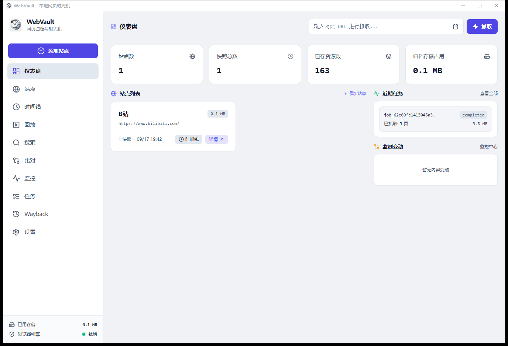

# WebVault (本地网页时光机)

WebVault 是一款运行在本地桌面的离线网页时光机与数字资产归档工具。基于 Tauri v2、Rust 与 React 构建，采用真实 Chromium (CDP) 监听捕获完整的 HTTP/HTTPS 网络流量会话，并以国际标准的 WARC 1.1 / WACZ 格式进行持久化归档。

支持离线 1:1 高保真回放、版本时间轴追溯、DOM 差异比对、本地全文检索与 Internet Archive 历史互联，所有数据均严格保存在本地。

[](https://github.com/rowanjove/webvault/releases/latest)
[](LICENSE)
[](https://github.com/rowanjove/webvault/releases/latest)

> **[点击前往 GitHub Releases 下载 Windows 安装包 / 便携版](https://github.com/rowanjove/webvault/releases/latest)**

---



---

## 为什么不是“另存为 HTML”？

现代 Web 应用高度依赖 SPA 路由、动态 import、Fetch/XHR 接口渲染、懒加载图片与 Web 字体。传统的“单文件另存为”或离线爬虫通常只能保留静态 HTML 骨架，在断网打开时往往样式丢失、脚本失效。

WebVault 的核心设计原则是**归档网络会话，而非单纯抓取文本**：

```text
真实 Chromium 浏览器 (CDP)
         │
         ▼
 监听完整网络会话 (Request / Response / Headers / Payload)
         │
         ▼
 写入标准 WARC / WACZ 归档文件
         │
         ▼
 本地内置沙箱 HTTP 回放代理 (URL 动态重写与离线注入)
```

---

## 核心特性

- **高保真网络会话捕获 (Capture)**  
  基于 CDP 驱动真实浏览器内核，捕获 HTML、CSS、JS、Web 字体、图片、XHR/Fetch 数据包；支持自动滚动、SPA 路由识别与动态渲染等待。
- **工业级归档标准 (Archive)**  
  支持 WARC 1.1 (ISO 28500) 格式分卷写入与哈希去重；提供 WACZ (Web Archive Collection Zipped) 格式的整站导入与导出。
- **沙箱离线回放服务 (Replay)**  
  内置本地回放代理服务，通过正则重写资源链接与 CSP 策略隔离，断网状态下仍能 1:1 还原历史网页排版与交互。
- **历史版本与差异对比 (Diff)**  
  同一 URL 多次抓取自动按时间线归集；支持并排对比两个历史版本的 DOM 结构、正文文本变动与元数据差异。
- **本地全文搜索引擎 (Search)**  
  基于 SQLite FTS5 引擎，对已抓取页面的正文和标题进行自动分词索引，支持秒级毫秒级本地全文检索。
- **自动化监控巡检 (Monitor)**  
  支持按分钟/小时周期定时监控指定页面，发现内容变动时自动创建新快照并记录变动事件。
- **Wayback Machine 互联 (Federate)**  
  直连 Internet Archive CDX API，快速检索任意网址的历史归档，并支持一键将 Wayback 历史快照导入本地离线库。
- **隐私与本地优先 (Local-First)**  
  无云端依赖、无遥测上报，数据库、快照文件与认证凭据全部存储于本地系统，严密防护数据隐私。

---

## 技术架构

- **宿主框架**：[Tauri v2](https://v2.tauri.app/)
- **核心系统语言**：Rust (2021 Edition)
  - 网络与代理：`tokio`, `axum`, `reqwest`, `tokio-tungstenite`
  - 归档解析：`flate2`, `zip`, `sha2`
  - 本地存储：`rusqlite` (Bundled SQLite + FTS5)
  - 差异分析：`similar`
- **前端工程**：React 18 + TypeScript + Vite + Tailwind CSS + Lucide Icons + Zustand

---

## 快速上手

### 环境准备

- **Node.js** >= 18.0.0
- **pnpm** >= 8.0.0
- **Rust** >= 1.75.0 (`rustup update stable`)
- 本地安装有任意 Chromium 内核浏览器（Chrome、Edge 或 Brave）

### 安装依赖

```bash
pnpm install
```

### 开发模式启动

运行前端开发服务器及 Tauri 桌面容器：

```bash
pnpm tauri dev
```

如仅需快速预览前端 UI 交互：

```bash
pnpm dev
```

### 项目构建与打包

生成生产环境安装包（Windows 下自动构建 NSIS 安装包与 MSI 文件）：

```bash
pnpm tauri build
```

构建生成的安装程序将存放于 `src-tauri/target/release/bundle/`。

---

## CLI 命令行模式

除桌面 GUI 外，WebVault 还提供完整的命令行工具接口：

```bash
# 单页快速抓取并自动滚动
webvault capture https://news.ycombinator.com/ --autoscroll

# 查看所有已归档站点
webvault list-sites

# 本地全文检索
webvault search "rust release"

# 导出整站为 WACZ 规范文件
webvault export --site-id <SITE_ID> --output archive.wacz

# 启动本地离线回放服务
webvault serve --port 8080
```

---

## 目录结构

```text
├── src/                      # 前端 UI 代码 (React + TypeScript)
│   ├── components/           # 布局与通用组件
│   ├── pages/                # 各功能模块页面 (Dashboard, TimeMachine, Monitor...)
│   ├── stores/               # Zustand 全局状态管理
│   └── services/             # Tauri IPC 接口通信层
├── src-tauri/                # 后端核心代码 (Rust)
│   ├── src/
│   │   ├── archive/          # WARC / WACZ 读写与哈希去重
│   │   ├── capture/          # CDP 驱动、浏览器发现与行为控制
│   │   ├── crawler/          # 爬虫边界、深度控制与 URL 归一化
│   │   ├── database/         # SQLite 数据库模式与 FTS5 全文索引
│   │   ├── diff/             # DOM 与文本差异对比引擎
│   │   ├── monitor/          # 定时监控与变动巡检引擎
│   │   ├── replay/           # 本地离线回放 HTTP 代理服务
│   │   ├── search/           # 全文检索查询服务
│   │   ├── wayback/          # Internet Archive CDX 客户端
│   │   └── cli.rs            # 命令行交互实现
│   └── tauri.conf.json       # Tauri 客户端配置
├── docs/                     # 文档与截图资源
│   └── screenshots/
└── package.json
```

---

## 安全与隐私说明

1. **零外部数据收集**：WebVault 完全运行于用户本机环境，不包含任何遥测、分析或云端上报代码。
2. **凭据安全**：登录抓取时保存的 Cookie 与凭据仅存储于本地 SQLite 数据库中，严禁明文导出或同步。
3. **沙箱隔离**：离线回放归档网页时，所有页面运行在独立的沙箱 iframe 与本地反向代理内，自动剥离恶意重定向脚本，且无权调用 Tauri 的底层原生 API。

---

## 开源协议

本项目采用 [Apache-2.0 License](LICENSE) 授权许可。
